# 🛠️ DocuFlow AI: Autonomous Multi-Agent Document Workflow

<div align="center">


**An autonomous, stateful Multi-Agent document generation, self-correction, and audit workflow application.**  
*Developed as an internship project showcase demonstrating advanced agentic loop orchestration and human-in-the-loop controls.*

</div>

---

## 🏗️ System Architecture & Workflow DAG

DocuFlow AI is built as a stateful, cyclic state machine using a Directed Acyclic Graph (DAG) pattern rather than a linear pipeline. The central state is serialized and persisted in a database, allowing thread executions to pause, resume, and loop back dynamically.

```mermaid
graph TD
    %% Styling definitions
    classDef init fill:#1a1a2e,stroke:#adc6ff,stroke-width:2px;
    classDef agent fill:#201f20,stroke:#8c909f,stroke-width:2px;
    classDef check fill:#2a2a2b,stroke:#ffdcc6,stroke-width:2px;
    classDef hitl fill:#3a393a,stroke:#ffb786,stroke-dasharray: 5 5,stroke-width:2px;
    classDef endNode fill:#1c1b1c,stroke:#10B981,stroke-width:2px;

    %% Nodes
    A[Conception Hub: Raw Intake]:::init
    B[pgvector Stylesheet Lookup]:::check
    C["Writer Node (gemini-3.1-flash-lite)"]:::agent
    D["Critic Node (Llama 3.3 70B via Groq)"]:::agent
    E{Router Decision Edge}:::check
    F["Human-in-the-Loop Interrupt Gate"]:::hitl
    G["Deployment Node"]:::endNode

    %% Flow Paths
    A --> B
    B --> C
    C --> D
    D --> E
    
    %% Loops
    E -- "Score < 95 & Cycles < 3 (Loop back)" --> H[Increment Loop Count]
    H --> C
    
    E -- "Score >= 95" --> G
    E -- "Circuit Breaker: Cycles >= 3" --> F
    
    F -- "User Feedback (Resume Loop)" --> C
    F -- "User Approval (Final Deploy)" --> G
```



---

## 🌟 Key Technology Highlights

> [!NOTE]
> **Stateful Orchestration (LangGraph)**  
> Tracks the live document draft, validation scorecards, iteration log arrays, loop counters, and system statuses in a central Pydantic state model. State checkpoints are serialized at every node transition, ensuring re-entrancy safety.

> [!IMPORTANT]
> **Matryoshka Representation Learning (MRL)**  
> Generates context embeddings using `gemini-embedding-2`, explicitly truncated to **768 dimensions** using prefix-slicing. This maintains 98%+ retrieval accuracy while speeding up cosine-similarity searches inside `pgvector`.

> [!WARNING]
> **Circuit Breaker Loop Guard**  
> To contain API token budgets and prevent infinite semantic loops (e.g. Writer and Critic disputing constraints endlessly), execution is automatically interrupted and routed to the user's dashboard after 3 revision cycles.

---

## 📂 Monorepo Structure

```
DocuFlow/
├── frontend/                # Next.js 16 (App Router)
│   ├── src/
│   │   ├── app/             # Routing segments (/dashboard, /conception, /canvas)
│   │   ├── components/      # UI Cards, Sidebars, and top navigation wrappers
│   │   ├── hooks/           # useAgentSession hook (SSE stream parser & simulator)
│   │   └── types/           # Pydantic schemas mapped to TypeScript interfaces
│   ├── public/              # Static assets and icons
│   └── .env.example         # Template for client environment variables
│
├── backend/                 # FastAPI Gateway + LangGraph API
│   ├── app/
│   │   ├── config.py        # Settings and environment API key validations
│   │   ├── db.py            # SQLAlchemy database setup & pgvector lookup stubs
│   │   ├── graph.py         # LangGraph workflow compilation & Node definitions
│   │   ├── main.py          # FastAPI REST endpoints & Server-Sent Events stream
│   │   ├── schemas.py       # Pydantic schema declarations
│   │   └── state.py         # TypedDict graph state tracking definitions
│   └── requirements.txt     # Python backend dependencies
│
└── .gitignore               # Unified monorepo git exclusions
```

---

## 🚀 Local Startup Guide

### 1. Frontend Setup (Next.js)

1.  **Navigate to the frontend directory**:
    ```bash
    cd frontend
    ```
2.  **Configure environment variables**:
    ```bash
    cp .env.example .env.local
    ```
3.  **Install packages and run**:
    ```bash
    npm install
    npm run dev
    ```
    *   Open [http://localhost:3000](http://localhost:3000) to view the client.

### 2. Backend Setup (FastAPI)

1.  **Navigate to the backend directory**:
    ```bash
    cd backend
    ```
2.  **Create and activate a virtual environment**:
    ```bash
    python -m venv .venv
    source .venv/bin/activate
    ```
3.  **Install dependencies and run**:
    ```bash
    pip install -r requirements.txt
    uvicorn app.main:app --host 127.0.0.1 --port 8000 --reload
    ```
    *   Interactive Swagger API docs are available at [http://127.0.0.1:8000/docs](http://127.0.0.1:8000/docs).
